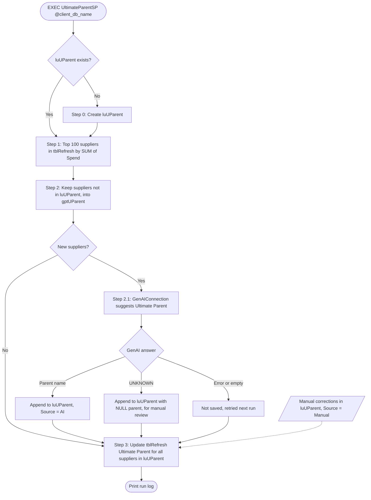

# UltimateParentSP - Process Diagram

Visual guide of `[aic_data].[dbo].[UltimateParentSP]`. See `UltimateParentSP_Instructions.txt` for details.

| Table | Role |
|---|---|
| `tblRefresh` | Monthly source data. `[Ultimate Parent]` is populated by the procedure. |
| `luUParent` | Lookup table, one row per `[Normalized Supplier]`. Grows with each run. |
| `gptUParent` | Staging table for the GenAI call. Re-created on every run. |
